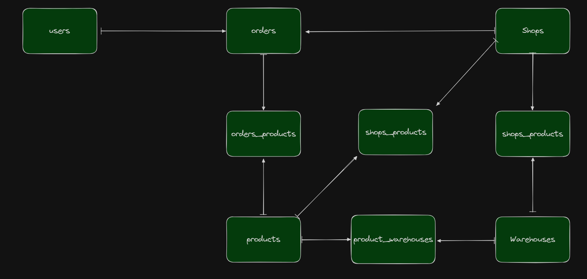

# EDOT - TECHNICAL TEST

*Note that this is only done in 5 hours since i didnt have a lot of spare time, a lot could be improved from here. as said "**building a complete e-commerce and stock management system is a complex task that requires careful planning**" 

this is unfinished submission, below i will tell you the design system i would build if i had the time. I've only managed to create two services which is **user_service** and **product_service**. 

The techstacks im using is **golang** and **sqlite** (for simplifying and mimic the behavior of each service has its own databases).

## APIs

### User Service

POST /register: Creates user using email.

POST /login: Authenticates users using email.

### Product Service
GET /products: Lists all products with stock availability.
### Order Service
POST /orders: Creates an order and reserves stock.

### Shop Service
GET /shops/{shopId}/warehouses: Lists warehouses associated with a shop.
### Warehouse Service
GET /warehouses: Lists all warehouses with their status.

POST /warehouses/transfer: Transfers stock between warehouses.

PATCH /warehouses/{warehouseId}/status: Activates or deactivates a warehouse.

## Locking System
For stock locking system, i will be using RabbitMQ delayed message.

- Whenever user created an order, it will retrieve the current stock of that product for that shop and the warehouses. Then it will deducted by the current reserved stock for that product and warehouse. If the deducted amount is less than the quantity of the order, the order should be failed.
- Upon order creation success, a rabbitmq delayed message is sent to release the stock if payment fails.
- There will be a consumer that consume the message and release the stock
- The delay duration aligns with the payment deadline (e.g., 30 minutes).

## Database
Since each service will have it's own database, here below the corresponding service and their database.

### User Service
1. users

### Product Service
1. products
2. product_shops

### Order Service
1. orders
2. order_products

### Shop Service
1. shop
2. shop_warehouses

### Warehouse Service
1. warehouses
2. warehouse_stocks

#### Data consistency
We can use messaging/event driven architecture to ensure data consistency across the databases.

## Project Structure / Technical Decision
- Used golang (Fiber) and microservices for performance and delivery speed,
- Project bootstrapped with APM for observability, robust logging that can be used to monitoring from Elastic, graceful shutdown, circuit breaker for each external service, clean code with granular testability (small unit test), general interface for multiple implementation option, development and production service configuration, stateless application that can be horizontally scaled using container orchestration.
- Using goroutines when calling multiple other services (if the calls not dependant one to another)

